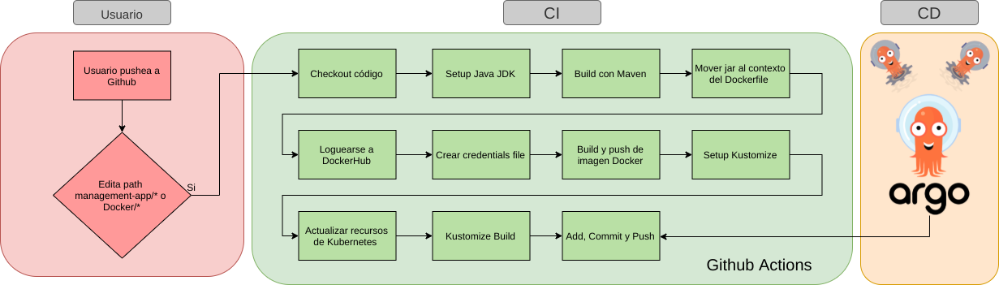
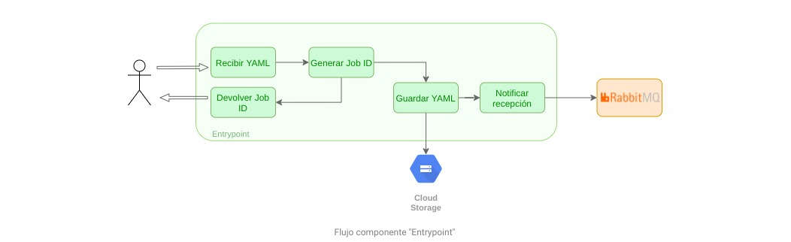
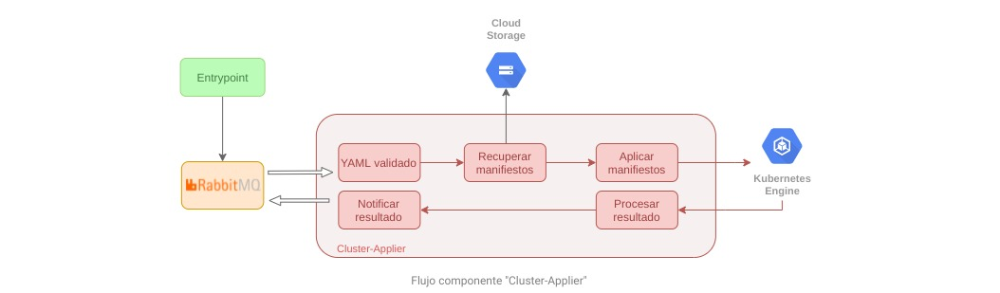
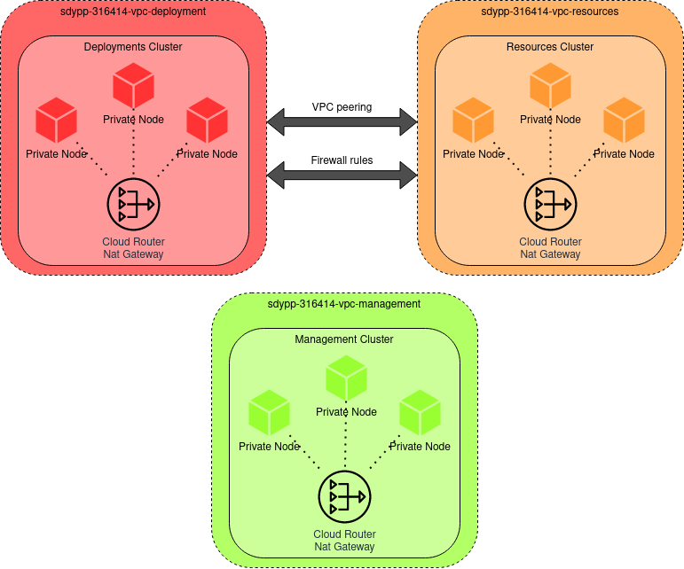
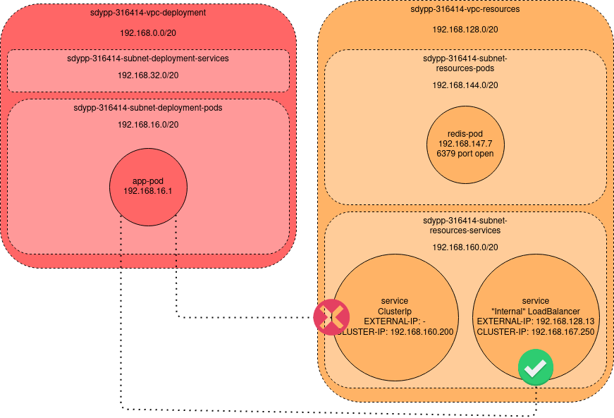

<h1 align="center">Trabajo Práctico Integrador </h1>
<h2 align="center">Sistemas Distribuidos y Programación Paralela</h2>

<p align="center">

</p>


## Introducción

En el contexto de la asignatura Sistemas Distribuidos y Programación Paralela de la Universidad Nacional de Luján, se propone y documenta la creación de una herramienta de cómputo intensivo basado en un modelo SWJ (Splitter-Worker-Joiner) para la resolución de tareas genéricas, apoyado en la plataforma de gestión de contenedores Kubernetes y tecnologías de Cloud Computing. Todos los componentes utilizados (propios y de terceros) presentan características de alta disponibilidad y tolerancia a fallos. 

La herramienta está orientada, por el momento, al uso exclusivo de los autores del trabajo. Sin embargo, se toman algunas consideraciones para soportar aspectos tales como cargas de tráfico mayores resultantes de publicar la aplicación. En la sección de Alcance se presentan los límites del mismo.

La motivación principal del trabajo es la necesidad ocasional de ejecutar tareas que se verían beneficiadas de una gran capacidad de cómputo para la obtención de resultados. Dado que el costo de contar con una infraestructura disponible 24/7 que permita satisfacer los requerimientos eventuales implicaría un costo excesivo y un gran desperdicio la mayor parte del tiempo, la propuesta considera desde la creación hasta la destrucción de los recursos necesarios de manera automatizada, tan solo configurando unas pocas variables dependientes. 

### Alcance

Concretamente, el presente trabajo aporta:
- Los scripts necesarios para la creación de la infraestructura en Google Cloud Platform mediante Terraform. 
- La documentación de los pasos previos requeridos para poder crearla.
- La configuración y puesta en funcionamiento de un pipeline de CI/CD para la herramienta en sí misma y los recursos auxiliares.
- Los manifiestos de Kubernetes que serán desplegados por el componente de CD (Continuous Delivery) y las imágenes de Docker para cada uno de los componentes de la herramienta, independientes de la tecnología subyacente. 
- Una herramienta de gestión denominada Management App, que permite ejecutar tareas genéricas con alta capacidad de cómputo de forma transparente al usuario.
- La configuración necesaria para lograr el auto-escalado de los componentes de apoyo e involucrados en la tarea del usuario, como así también la replicación de los mismos - cuando se requiera - para lograr tolerancia a fallos. 
- La documentación de cada uno de los recursos utilizados y su función en el proyecto, así como ventajas y desventajas identificadas por su uso. 
- La implementación de la herramienta Prometheus para el monitoreo de los servicios, y Fluentd para la recolección de logs, junto al stack ELK para identificar errores y fallas en la aplicación y sus dependencias, utilizando tableros de visualización y alertas. 


### Out-of-scope

Algunas cuestiones no consideradas por el trabajo hasta el momento, que presentan oportunidades de extensión a futuro, son:
- La publicación de la herramienta para uso de terceros, y como consecuencia:
    - La prevención de que individuos maliciosos la utilicen para ejecutar ataques.
    - Un esquema de medición y costo frente al uso de la herramienta.
    - Implementación de mecanismos de seguridad para evitar ataques a la propia infraestructura. 
- La posibilidad de entregar imágenes Dockerizadas o incluso, código fuente, en lugar de manifiestos de Kubernetes. 
- Desplegar Kubernetes obviando el servicio administrado provisto por GCP. Más información [aquí](https://github.com/kelseyhightower/kubernetes-the-hard-way).

## Management App

Es una aplicación orientada a microservicios encargada de procesar las tareas que el usuario final desea ejecutar en la plataforma HPC. Está diseñada con el propósito de escalar cuando se requiera, por lo que los componentes son independientes entre sí, comunicados a través de colas de mensajería, compartiendo un *storage* en común y utilizando una caché para el almacenamiento de estado de las tareas. 


## Pipeline CICD

La Management App cuenta con un pipeline de CI (Continuous Integration o Integración Continua) que se activa al modificar el código fuente del proyecto o algún Dockerfile dentro del directorio `Docker/`. Esta funcionalidad está implementada a través de Github Actions, reaccionando ante commits del usuario a los paths correspondientes del repositorio.

A su vez, frente a la modificación en los manifiestos de las carpetas `Kubernetes/Management` y `Kubernetes/Resources` - sea manual (por el usuario) o automática (llevada a cabo por Github Actions en el pipeline de CI) - se desencadena el circuito de CD (Continuous Deployment o Entrega continua) implementado a través de ArgoCD, quien se encargará de determinar las diferencias en los manifiestos del clúster correspondiente, aplicando estos cambios y reflejando el estado correcto. 

En el gráfico a continuación, se detallan los pasos y la relación entre CI/CD para la Management app.




### Etapas del pipeline

A continuación, una breve explicación de cada uno de los pasos involucrados en el pipeline de la *Management app*. Dado que la aplicación está compuesta de varios microservicios, debemos considerar que el flujo será idéntico para cada uno de ellos, a excepción de las rutas de los directorios involucrados.

1. **Preparación - Setup Job**: En este caso, Github corre un ubuntu-latest en el cual realizará los pasos declarados en cada uno de los *workflows* de la carpeta `github/workflows/`.
2. **Checkout código**: Clona el repositorio completo, para poder armar la imagen Docker con los últimos cambios.
3. **Setup Java JDK**: Instala y disponibiliza Java JDK para poder compilar el código Java de cada una de los componentes.
4. **Build con Maven**: Empaqueta el código en un archivo .jar, y lo guarda en el directorio del componente, bajo la ruta `/target`.
5. **Mover el jar al contexto del Dockerfile**: Mueve el archivo .jar creado en el paso anterior al directorio `Docker/` del proyecto, en una subcarpeta correspondiente al componente afectado.
6. **Loguearse a DockerHub**: Se autentica con DockerHub utilizando un nombre de usuario y un token, para permitir subir la imagen luego de armarla.
7. **Crear archivo de credentiales**: Arma un archivo de credenciales cuyo contenido es un *secret* del repostorio, requerido por el código para autenticarse en el clúster de Deployments y acceder al *Storage* compartido.
8. **Build y Push de imagen docker**: Se construye la imagen de Docker utilizando el Dockerfile del componente bajo el subdirectorio correspondiente en la carpeta `Docker/`. Luego, se realiza un push de la imagen a dockerHub.
9. **Setup Kustomize**: Instala y disponibiliza Kustomize, que permitirá modificar la imagen de un manifiesto de Kubernetes de forma sencilla.
10. **Actualizar recursos de Kubernetes**: Actualiza el tag de la imagen docker creada en el paso 8, en un archivo de variables de Kustomize.
11. **Kustomize Build**: Aplica el archivo de variables de Kustomize sobre un template, generando el archivo .yaml de salida para el componente afectado, que será colocado en el directorio `Kubernetes/` bajo el subdirectorio correspondiente. Cabe destacar que este archivo contendrá el tag de la imagen actualizado.
12. **Agregar cambios, realizar commit y push**: Se ejecutan los comandos de *git* necesarios para publicar los cambios en el repositorio, lo que provoca que ArgoCD detecte una modificación de los archivos .yaml de Kubernetes y los aplique en el clúster, completando así el pipeline CICD.

**Importante**: En el caso de los componentes del clúster de *Resources* representados por los manifiestos de la carpeta `Kubernetes/Resources`, el circuito de CI no es necesario dado que no se trabaja con el código fuente. Sin embargo, se aprovechan las bondades de ArgoCD para su despliegue en el clúster.


### Entrypoint 

Es un servicio desarrollado en Java que expone endpoints HTTP desde los cuales recibirá las solicitudes de procesamiento de los usuarios. Cada endpoint espera recibir contenido distinto dependiendo del formato que utilice el usuario para informar la tarea a ejecutar. En el caso de solicitar la ejecución de la tarea mediante manifiestos de Kubernetes, se deberá enviar un `POST /yaml` entregando como cuerpo de la solicitud un conjunto de archivos en formato YAML a aplicar en el clúster. 



Una vez recibida la tarea, el componente genera un identificador que vincule los archivos subidos y los deposita en un almacenamiento compartido con el resto de los microservicios. A su vez, emite un mensaje a un *exchange* de RabbitMQ para notificar a los componentes interesados que existe una tarea en formato YAML pendiente de validación.


### YAML Manager

Frente a la notificación emitida por el Entrypoint, el YAML Manager accederá al almacenamiento compartido para descargar los archivos bajo el identificador recibido y llevará a cabo un circuito de validación. Dependiendo del estado de los manifiestos, procederá a depositarlos nuevamente en el mismo *storage* con las modificaciones pertinentes sobre los archivos originales. A su vez, generará una notificación que será enviada a RabbitMQ para avisar al resto de los componentes sobre el estado de la validación. 


### Cluster Applier

Una vez validados los YAML del usuario, la Management App se encuentra en condiciones de aplicar los manifiestos sobre el clúster de *Deployment*. Esta es la tarea del Cluster Applier, que al recibir la notificación del YAML Manager indicando la validación exitosa, accederá al *storage* compartido para descargar los archivos y aplicarlos. 




Para poder interactuar con el clúster, el Cluster Applier utiliza la herramienta de linea de comandos de Kubernetes: `kubectl`. Para ello, necesita tenerla instalada en el entorno de ejecución; por eso, en `Docker/Cluster-Applier/Dockerfile` podemos observar el uso de una imagen base de OpenJDK propia y modificada, cuyo contenido puede verse reflejado en `Docker/Openjdk/Dockerfile`.

### Status Worker

Se trata de un componente auxiliar que da seguimiento al estado del job del usuario. A partir del evento de "tarea pendiente" publicado por el Entrypoint, el Status Worker almacena en Redis el identificador de la tarea junto con un estado PENDING. Una vez validados los YAMLs del usuario y publicado el evento por el YAML Manager, se procede a la actualización del estado a APPLYING_IN_CLUSTER. Cuando el Cluster Applier finaliza la aplicación de los manifiestos y emite el evento correspondiente, este componente actualiza el estado a DONE. Eventualmente, el usuario solicitará la eliminación de la tarea, por lo que se realizará una vuelta atrás de los recursos en el clúster. Esto dispara la notificación correspondiente, resultando en una actualización del estado a ROLLED_BACK.

Gracias a la arquitectura desacoplada de la solución, este componente se suscribe a los mismos *exchanges* utilizados por el resto de los microservicios, sin necesidad de hacer explícito el envío de los mensajes.

El servicio expone un endpoint HTTP desde el cual puede consultarse el estado de la tarea a través del identificador generado para la misma. 

## Infraestructura

Tanto la Management App como los recursos auxiliares y - principalmente - las tareas del usuario, son gestionados mediante la plataforma de contenedores Kubernetes. A continuación, se brinda mayor detalle con respecto a la distribución de los recursos, proveedor de cómputo en la nube utilizado, interrelación entre los servicios necesarios, entre otros.



La arquitectura de la aplicación consta de 3 clústers: *deployments*, *resources* y *management*. Todos ellos poseen *nodos privados*, es decir, que no tienen direcciones IP públicas. Esta decisión se ve justificada por el costo y porque en el presente resultan dispensables.

Cada clúster tiene configurada una *VPC* o *Virtual Private Cloud*, donde se alojan los *nodos*, *pods* y *servicios* de cada uno.

Para lograr que los nodos tengan acceso a Internet, fue necesario configurar un *Cloud Router* en cada una de las *VPCs* de los clústers, que realice un enmascaramiento de la dirección IP privada por una pública. Esto se logró utilizando *Cloud NAT*.

Las instancias utilizadas son de tipo *preemptible*, equivalentes a las conocidas como *instancias spot* en AWS, ya que tienen un costo reducido. Como contrapartida, solo duran 24 horas como máximo lo cual puede resultar inconveniente para ciertos casos de uso.

Los clústers de *deployments* y *resources* deben poder comunicarse entre sí, ya que las aplicaciones que se encuentren en el primero necesitan consumir los servicios que proveen los recursos alojados en el segundo. Para esto fue necesario configurar *VPC Peering*, habilitando el routeo entre las *VPCs* del clúster de *deployments* y el de *resources*.

A su vez, fue necesario agregar las respectivas reglas de *firewall* para permitir el tráfico entre las *VPCs* mencionadas anteriormente.

Todos los clústers se encuentran configurados con *cluster auto scaler* y *horizontal pod autoscaler*.



Para lograr comunicar a las aplicaciones del clúster de *deployments* con los recursos alojados en el clúster de *resources* fue necesario levantar servicios de tipo "internal", ya que - de lo contrario - los pods de las aplicaciones no podían acceder a los servicios, por más que se encuentren en *VPCs* emparejadas, con el tráfico permitido a través del firewall.

### GKE

Se utilizó Google Kubernetes Engine como servicio administrado para el despliegue de Kubernetes. Si bien existen diversos proveedores, la elección de GCP, se ve justificada por la oferta de 300USD de crédito y la certeza de que no se cobrara nada a la tarjeta introducida.

#### Separación de responsabilidades

Tal lo mencionado, se desplegaron tres clústers para mantener una separación de responsabilidades e incrementar la seguridad mediante el aislamiento total de los recursos. Si bien podrían haberse tomado otros aproximamientos para lograr un fin similar (por ejemplo, mediante el uso de *namespaces*), consideramos que desde la perspectiva de la escalibilidad resulta más conveniente la separación. Por otra parte, los fines didácticos complementan la elección.  

A nivel funcional, el clúster de *management* contiene cada uno de los microservicios que conforman la Management App, junto con los recursos que esta necesita. Este despliega las tareas del usuario en el clúster de *deployment*, por lo que no existe un contacto directo entre aplicaciones externas y la de gestión. A su vez, la plataforma provee al usuario servicios complementarios tales como RabbitMQ y Redis. Estos últimos se encuentran en un clúster adicional, denominado *resources*. 

#### Interconexión de clústers

Para sostener el aislamiento planteado, cada clúster se encuentra en una VPC distinta. Sin embargo, por motivos funcionales, los recursos del clúster de *deployment* necesitan acceder a los servicios del de *resources*. Como consecuencia, para que dos servicios en VPCs diferentes lograran comunicarse, fue necesario llevar a cabo configuraciones adicionales, detalladas a continuación. 

Por otro lado, fue deseable que los servicios levantados en el clúster de recursos pudieran ser accedidos mediante un mnemónico en lugar de su dirección IP, dado que no consideramos aceptable que esta última fuese un valor estático. Para resolver este inconveniente, fue necesario acudir a las bondades de un recurso adicional, detallado posteriormente.

##### VPC Peering, Reglas de firewall e Internal Services

En GCP, la interconexión de dos redes privadas virtuales es posible mediante el uso de la tecnología denominada *VPC Peering*. La configuración de la misma debe llevarse a cabo de forma recíproca, esto implica que - en ambas VPCs - se establezca un emparejamiento desde la red origen hacia la red destino, respectivamente. 

Además, para poder cursar el tráfico entre las VPCs vinculadas, es necesario definir las reglas de firewall correspondientes, permitiendo los paquetes entrantes hacia los puertos de Redis y RabbitMQ.

Aún con las dos configuraciones previas, no bastaba para que los servicios definidos como ClusterIP pudieran ser accedidos desde fuera del clúster, sino que fue necesario declarar a los servicios de tipo LoadBalancer y con una anotación "internal". 

```yaml
...
    type: LoadBalancer
    annotations: 
      networking.gke.io/load-balancer-type: "Internal"
...
```

De esta forma, la IP externa del LoadBalancer deja de ser una IP pública como normalmente lo es, y pasa a ser una IP privada del subrango correspondiente a la red de VPC (en lugar de la subnet de *resources*). Dicho rango es accesible por los *pods* ejecutándose en la subred de la VPC emparejada.

##### ExternalDNS y CloudDNS

Con lo configurado en la sección previa, contamos con un servicio que tiene una IP que puede ser accedida desde el clúster de *deployments* al clúster de *resources*. Bajo una configuración tradicional, donde todos los recursos se encuentran desplegados en un único clúster, los *pods* podrían alcanzar los servicios mediante un mnemónico, manejado por *kubedns*. Sin embargo, recordando la separación implementada en esta arquitectura, nos encontramos con la imposibilidad de acceder a dicha facilidad. Por consiguiente, fue necesario registrar el servicio en CloudDNS, la API de GCP que permite establecer un mnemónico que puede ser consultado desde cualquier instancia del clúster. Si bien podría haberse registrado de manera manual como una entrada estática en los registros DNS, decidimos ir un paso más allá e implementar la carga y actualización automática del registro mediante la herramienta ExternalDNS. Esta última - a todos los servicios anotados con la anotación correspondiente luego de ser creados - reemplaza el *fully qualified domain name* (FQDN) de la anotación por la dirección IP asignada al servicio. 

```yaml
...
    type: LoadBalancer
    annotations: 
      networking.gke.io/load-balancer-type: "Internal"
      external-dns.alpha.kubernetes.io/hostname: redis-service.framework.services.gcp.com.ar.
...
```


#### Clúster privado, Cloud NAT y Cloud Router

Si bien GCP ofrece cŕedito gratuito, tiene algunas limitaciones llamadas *quotas*. Una de estas consiste en el número de direcciones IP públicas que pueden utilizarse. Dado que en el proyecto contamos con más de 8 nodos, cada uno con una IP pública, nos vimos obligados a evitar que todos los nodos tengan una IP pública. GCP ofrece este tipo de instancias bajo la denominación de nodos privados, resultando en un clúster con un único punto de acceso. 

Ahora bien, debido a la falta de una dirección routeable en Internet, y el requisito de que los los nodos tengan acceso a esta última, fue necesario configurar otro servicio proporcionado por Google, denominado Cloud NAT, que requiere ser aplicado a un Cloud Router vinculado a una VPC. Cabe destacar que esta configuración fue aplicada en los tres clústers, resultando en tres Cloud Routers que realizan Cloud NAT para sus respectivas VPCs. 


#### Instancias *Preemptible*

En pos de reducir los costos y ampliar la duración de los créditos disponibles, se utilizaron instancias *preemptible*. Estas últimas, a diferencia de las denominadas *on demand*, tienen un costo tres veces inferior con la consecuencia de que duran - como máximo - 24 hrs. Sin embargo, previo a ese rango temporal, la instancia podría "caerse". Al suceder esto, Kubernetes intenta reubicar los *pods* del nodo afectado a algún otro del clúster. Probablemente, al concretarse dicha acción, algún *pod* no tenga suficientes recursos (cpu y/o memoria) en el nodo asignado. Como consecuencia, GKE instancia un nuevo nodo, ya que se encuentra habilitada la característica de *cluster autoscaler*.


#### Google Storage

La Management App utiliza un almacenamiento compartido entre los distintos microservicios. La herramienta utilizada para dar soporte a esta necesidad es Google Storage por formar parte de la suite de GCP. Además, este *storage* está disponible para los usuarios que lo requieran. 


### Terraform

Todos los recursos mencionados anteriormente podrían ser desplegados de forma manual mediante alguna interfaz de GCP. Sin embargo, optamos por la opción de Infraestructura como Código (IaaC) a través de la herramienta Terraform. Para ello se cuenta con un archivo principal, el cual hace uso de los módulos de Google necesarios para satisfacer los requerimientos de infraestructura, junto a un archivo de variables, que permite personalizar el despliegue con los parámetros del proyecto actual. 

El archivo mencionado consta de una serie de bloques denominados módulos, denotados por la palabra reservada *module* junto a un identificador y un grupo de entradas, entre las cuales debe encontrarse la propiedad "source", que indica el origen del código fuente del módulo. 


### Scripts

Dado que el proyecto fue construido con el propósito de ser utilizado desde cero sin necesidad de conocer en detalle su funcionamiento, se construyeron los scripts necesarios para crear y descartar todos los elementos involucrados, facilitando la tarea al usuario, ya que Terraform no era suficiente para cubrir por completo esta tarea. Por lo tanto, apuntamos a complementar tanto la etapa previa y posterior a la construcción y destrucción de la infraestructura. 

#### Init

Este puede encontrase en `/Terraform/init.sh`.
La funcionalidad de este script es inicializar una cuenta de Google Cloud Platform recien creada. Primero se logeará en esta cuenta, se creará el proyecto, las cuentas de servicio, se otargarán roles/permisos a estas. Se habilitarán las API necesarias, se habilitará la cuenta de facturación, se genera el archivo de credenciales.

#### Despliegue

Este puede encontrarse en `/Terraform/deploy.sh`.
Una vez cumplidas las condiciones para el despliegue, este script realizará esa tarea. Exportará la variable necesaria para ubicar el archivo de credenciales, ejecutará los comandos necesarios de Terraform para desplegar la infraestructura. Establecerá el secret de github que contiene las credenciales de la cuenta de GCP, para poder acceder, junto con el archivo kubeconfig, al cluster de Deployments. Descarga la ultima version de ArgoCD, aplica el manifiesto en todos los cluster e instala todas las aplicaciones de ArgoCD ubicadas en el directorio ArgoCD y el subdirectorio homonimo a cada cluster. Instala External-dns en el cluster de Resources y realiza un commit de los cambios realizados al repositorio. (Add/Update kubeconfig.conf, Add/Update external-dns)

#### Get Credentials

Este puede encontrarse en `/Terraform/get_credentials.sh`.
La funcionalidad de este script es establecer las credentiales de los cluster desplegados en el equipo local. Establece el proyecto actual en gcloud, crea un nuevo archivo de credenciales, lo activa, remueve las credenciales viejas de kubectl, y obtiene las nuevas.

#### Destrucción

Este puede encontrarse en `/Terraform/destroy.sh`. 
Este script elimina toda la insfraestructura, aplicaciones, configuraciones.
Si bien bastaría con "terraform destroy", existen ciertos recursos creados posteriormente al despliegue, que requieren ser eliminados previamente a ejecutar dicho comando de terraform, dado que, de lo contrario, no coincidiría el estado que terraform percibe contra el real, fallando en tiempo de ejecución.


## Kubernetes

Dado que la aplicación se orientó al uso de contenedores, se utilizó el orquestador Kubernetes. 
Se eligio este enfoque debido a su portabilidad, y facilidad de despliegue, aislamiento y demás ventajas de provee. Sumado a la tolerancia a fallos, escalabilidad que nos provee un orquestador de contenedores, como por ejemplo, Kubernetes.

### Manifiestos

Cuando utilizamos Kubernetes la forma en que podemos indicarle los recursos que queremos que gestione son los manifiestos. La unidad minima de Kubernetes son los pods, los cuales contienen uno o varios contenedores Docker. Dichos pods pueden ser instanciados mediante un Deployment, indicando la cantidad de replicas deseadas. Cada manifiesto puede ser aplicado en un Namespace, el cual provee de aislamiento a los pods. Es necesario indicar una etiqueta en cada Deployment que permite a un Service localizar y enviar trafico a sus pods. Existen varios tipos de Services, los cuales son, ClusterIP, NodePort y LoadBalacer.

ClusterIP crea una dirección IP estática, accesible desde todos los recursos del cluster.

NodePort habilita un puerto en un nodo, que permite ingresar trafico del exterior, y que se redireccione al pod correspondiente, sin importar si este se encuentra en dicho nodo o no.

LoadBalancer levanta un nuevo recurso, el cual tiene una IP pública, que balancea la carga de las peticiones hacia los pods correspondientes.

La arquitectura de la solución a nivel de manifiestos tiene la siguiente estructura:

El tráfico es dirigido al Entrypoint por una IP pública expuesta mediante el Ingress. Este ultimo requiere al Service de un deployment para dirigir los paquetes hacia los pods. El Entrypoint envía los mensajes a RabbitMQ que serán recibidos por los pods de los demás deployments.

### Helm

Como se apreció en el grafico anterior, en el caso de aplicaciónes de terceros, se utilizaron Helm Charts para su despliegue. Los cuales encapsulan la complejidad del deploy una aplicación completa. Incluyendo Deployments, Servicios, Persistencia y Configuraciones. 
Tipicamente para el uso de Helm, es necesario importar el repositorio del Chart, y personalizarlo en un archivo, comunmente llamado, values.yaml. En este último, es posible, realizar configuraciones tanto simples como complejas, pudiendo por ejemplo, desplegar una aplicación con una sola instancia, sin replicación como tambien, desplegarla en modo cluster con tan solo ajustar un parámetro en el archivo de valores.

Como vimos en los fragmentos de manifiestos de la sección [GKE](https://github.com/AgustinNormand/SDyPP_TPI#gke), si bien podría pensarse que se trata de anotaciones sobre el servicio, en realidad, estas fueron agregadas al archivo de valores, que luego Helm añadirá al servicio final. Dado que es posible modificar varios parámetros es necesario especificar de manera concreta que cual de ellos queremos personalizar. Para obtener los posibles cambios que podemos realizar, Helm nos ofrece el comando ` helm show values CHART_NAME `

Considerando esto, los fragmentos mencionados, se verían de la siguiente manera:
```yaml
service:
  type: LoadBalancer
  annotations: 
    networking.gke.io/load-balancer-type: "Internal"
    external-dns.alpha.kubernetes.io/hostname: redis-service.framework.services.gcp.com.ar.
```

### ArgoCD apps

Si bien los manifiestos creados podrían aplicarse manualmente mediante la herramienta "kubectl" en el proyecto como se mencionó anteriormente ArgoCD realiza el despliegue automático tanto de manifiestos como de Helm Charts.

Esto se realiza a traves de Custom Resources definidos por ArgoCD llamados Application. Cada uno de ellos cuenta con un nombre, un Namespace en el que será aplicado, un origen desde el cual extraer los manifiestos y la politica de sincronización.

ArgoCD soporta Helm de dos maneras, indicando un repositorio de Helm en el "RepoURL" o indicando un repositorio de Github donde contenga un Helm Sub-Chart. Optando por la primer opción, no contaríamos con el archivo de values.yaml en el repositorio de Github, lo cual no sigue el principio de Single Source of Truth. En cambio, implementando la segunda, sería posible versionar el archivo de valores.

Ejemplos se pueden encontrar en el directorio `ArgoCD/`.


## Replication

En búsqueda de garantizar la alta disponibilidad y tolerancia a fallos de la aplicación, los recursos con estado y cuya caída podría producir pérdidas de información, han sido configurados en modo clúster. Puntualmente, tanto RabbitMQ como Redis habilitan las opciones de *clustering* para mantener sincronizadas las réplicas en referencia a sus respectivos componentes internos. 


### Redis Cluster Mode

Tal lo mencionado, Redis Cluster ha sido desplegado mediante un Helm Chart. Este último se trata de una implementación específica, separada de Redis bajo la modalidad *single instance*. Inspeccionando sus componentes, nos aproximamos a entender qué está haciendo por detŕas, ampliando la comprensión de su funcionamiento. 

Entre los recursos que son instanciados al desplegar el Chart, encontraremos un StatefulSet que de manera similar a un Deployment gestiona los pods de una aplicación, su despliegue y escalado, pero que además, garantiza el orden y unicidad de dichos pods, manteniendo una identidad asociada a los mismos. Esto facilita las condiciones necesarias para la gestión de aplicaciones con estado, tal como Redis Cluster. Los StatefulSets requieren un PersistenceVolume para el almacenamiento de sus pods, que también se encuentra dentro del despliegue de Helm.

Por otro lado, es requerido contar con un Service de tipo *headless* responsable de la identidad de estos pods. Sin embargo, existirá un Service de tipo LoadBalancer que será utilizado para el acceso efectivo a la aplicación. Cada uno de ellos generará los respectivos Endpoints y Endpoint Slices para garantizar la escalabilidad de los mismos.

A su vez, existen recursos de configuración tales como ConfigMaps y Secrets. 

#### Fragmentación de los valores

Bajo el modo *clustering* de Redis, los valores son almacenados de forma distribuida, en los diferentes nodos del clúster. Esto se logra obteniendo el hash de la clave a almacenar y determinando en base a este, el nodo en que deberá persistirse. Ahora bien, todos los miembros del clúster llevarán un registro de la localización de cada clave, posibilitando la consulta de cualquier clave a cualquier nodo. En caso que este último no contenga la clave almacenada, devolverá un mensaje de redirección hacia el nodo adecuado. 

Tanto en la herramienta CLI como en el cliente Lettuce de Java - utilizado en las aplicaciones para acceder al clúster - la redirección no es automática a menos que así se configure. De esta manera, para lograr transparencia en la ubicación de los valores, será necesario utilizar este parámetro. 


### RabbitMQ clúster Mode

A diferencia de la configuración de Redis Cluster, en el caso de RabbitMQ no fue necesario utilizar un Helm diferente, sino que tan solo utilizando el mismo con el que levantaríamos la aplicación en modo *single instance* podía levantarse en modo clúster, modificando la cantidad de réplicas. 

Se ha llevado a cabo un experimento con la aplicación para mejorar el entendimiento, utilizando la configuración por defecto del Chart de prueba y verificando los componentes levantados. Luego, utilizando la configuración definitiva especificando las réplicas deseadas y logrando características de tolerancia a fallos, comparamos los recursos instanciados. Como conclusión, al comprobar que en ambos casos se despliegan los mismos componentes, notamos que RabbitMQ en modo *single instance* no es más que un "clúster" con una sola instancia. 


#### Replicación de las colas

Al utilizar RabbitMQ bajo un esquema de múltiples réplicas, por defecto contaremos con redundancia a nivel de *virtual hosts*, *exchanges*, *users* y *permissions*. Por lo tanto, frente a la caída de alguno de los nodos, estos componentes serían tolerantes a dicha falla. Sin embargo, un recurso fundamental que podría perderse al utilizar la configuración tradicional, son las colas. Esto resultaría crítico por la pérdida de mensajes. Para resolverlo, RabbitMQ ofrece distintas alternativas. Por un lado, el clásico *queue mirroring*, hoy en día reemplazado por opciones más eficientes como los tipos de cola Quorum y Streams. 

La *Quorum queue* es un tipo de cola moderna de RabbitMQ que implementa durabilidad y replicación, basado en el algoritmo de consenso de Raft, bajo un esquema FIFO y cuya prioridad es mantener los datos seguros. Están diseñadas para ser más seguras y más simples que las colas *Mirror*, debiendo ser consideradas la implementación por defecto para lograr alta disponibilidad y presentando, sin embargo, algunas limitaciones al compararlas con las tradicionales, como pueden ser la no exclusividad, la obligación de durabilidad y la única posibilidad de definir persistencia a nivel de cola (en vez de por mensaje), etc.


## Autoscaling

Como parte de las características de alta disponibilidad perseguidas, es necesario garantizar que la aplicación no sufrirá impactos frente al aumento de tráfico. El escalado automático será el mecanismo que asegure que los componentes requeridos aumenten el número de réplicas para soportar los requisitos de procesamiento. 


### Cluster Autoscaler

Los servicios administrados de Kubernetes de los diferentes proveedores de Cloud Computing ofrecen herramientas para escalar automáticamente los nodos que componen un clúster. GKE nos brinda esta funcionalidad mediante el denominado "Cluster Autoscaler", que cambiará la cantidad de nodos de acuerdo a las demandas de las cargas de trabajo. Gracias a ello, y junto al "Node autoprovisioning", evitaremos agregar y quitar nodos de forma manual. Tan solo especificaremos el tamaño mínimo y máximo de nodos que conformarán el clúster, y GKE gestionará el tamaño adecuado en base a las exigencias del momento. 

Concretamente, la decisión de escalar será tomada en base a las solicitudes de recursos de los pods que se ejecutan en los nodos del clúster. En caso que no se logre colocar los pods requeridos por falta de recursos, el *scaler* agregará los nodos necesarios siempre y cuando no se exceda el máximo configurado. Por el contrario, si existiera capacidad de sobra para programar todos los pods con una cantidad menor de nodos, entonces el *scaler* quitará los sobrantes, a menos que se haya alcanzado el límite inferior. 


### HPA

Kubernetes ofrece el recurso llamado "Horizontal Pod Autoscaler" para aumentar el número de pods de un *Deployment*, *ReplicaSet*, *StatefulSet* o *ReplicationController*. A partir de la extracción y evaluación de métricas tales como la utilización de CPU o memoria, o incluso parámetros personalizados provistos por la aplicación, el HPA determinará la necesidad de aumentar o disminuir los pods para alcanzar el valor de la métrica declarada.

Internamente, HPA utiliza un mecanismo de *querying* para determinar el valor de la métrica en ese instante, compararlo contra el valor indicado en el manifiesto y en base a ello determinar si requiere aumentar la cantidad de pods (valor real por encima del target) o disminuirla (valor real por debajo del target), respetando los valores mínimos y máximos especificados.

#### Management Clúster

Dentro del clúster de *management* se ha utilizado HPA para el escalado horizontal de los pods de cada uno de los componentes de la aplicación de gestión. El Entrypoint, por un lado, define la necesidad de escalado en base a la cantidad de solicitudes HTTP recibidas en una franja temporal arbitraria. Esto resulta conveniente, dado que la cantidad de tráfico que está recibiendo es altamente representativa de los requisitos de procesamiento del servicio. 

Por otra parte, los componentes restantes - YamlManager, ClusterApplier y StatusWorker - se caracterizan por no exponer endpoints HTTP para tareas complejas, sino que reciben las tareas a partir del bróker de mensajería. Por ende, tenemos certeza de que tendrán mayor o menor carga de trabajo dependiendo de los mensajes acumulados en las colas a las que están suscriptos. Por lo tanto, esta es la métrica elegida para determinar el requerimiento de escalado.


#### Deployments Clúster

Dado que - tal lo mencionado en secciones anteriores - el clúster de *deployments* está dedicado a ejecutar las cargas de trabajo intensivas del usuario y estas se adecúan al modelo SWJ (Splitter-Worker-Joiner), podemos suponer que los requerimientos de escalado estarán dados por la utilización de CPU de los *workers*. Como parte de la gestión de las tareas subidas por el usuario y las facilidades brindadas al mismo, la Management App agrega a los *jobs* un manifiesto HPA para ser aplicado en el clúster, referenciando al recurso Worker enviado. 


### Custom metrics

Acá presentar todo lo necesario para poder levantar las métricas de Rabbit, http, rules de prometheus

Prometheus
Prometheus Adapter
Recording Rules
Custom API
Ingress
Ingres Controller NGINX


## Logging/Monitoring

Fluent-bit
Logstash
Elasticsearch Cluster Mode
Kibana
Grafana
Prometheus ?
