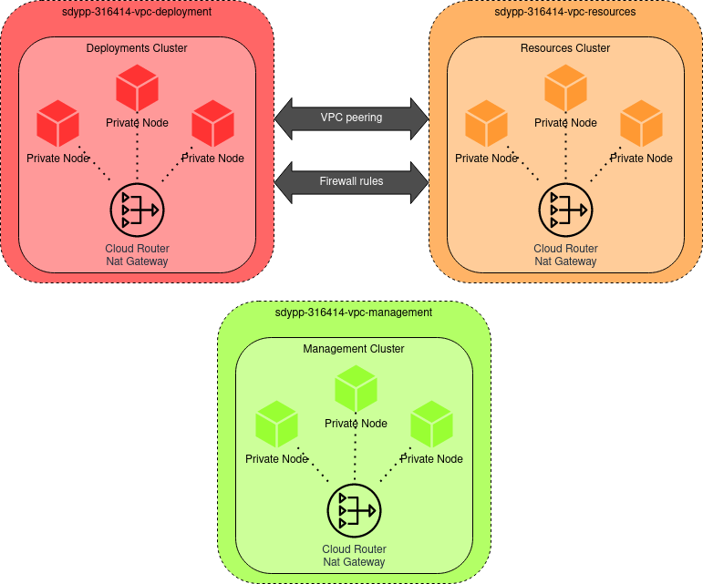

<h1 align="center">Trabajo Práctico Integrador </h1>
<h2 align="center">Sistemas Distribuidos y Programación Paralela</h2>

### Introducción

Desarrollo de un framework de HPC basado en un modelo SWJ (Splitter-Worker-Joiner) para la resolución de tareas genéricas,
de naturaleza distribuida haciendo uso de recursos de soporte tales como RabbitMQ y Redis.  

### Arquitectura de la solución

La arquitectura de la aplicación consta de 3 clusters: uno de *deployments*, otro de *resources* y el último de *management*. Estos clusters poseen *nodos privados*, es decir, no tienen direcciones ip públicas, ya que estas son caras, y además, no las necesitábamos. 

Cada cluster tiene configurada una *VPC* o *Virtual Private Cloud*, donde se alojan los *nodos*, *pods* y *servicios* de cada cluster.

Para lograr que los nodos tengan acceso a Internet, fue necesario configurar un *Cloud Router* en cada una de las *vpc* de los clusters, que realice un enmascaramiento de la dirección IP privada por una pública. Esto se logró utilizando *Cloud NAT*.

Las instancias utilizadas son de tipo *preemptible*, equivalentes a las conocidas como *instancias spot* en AWS, ya que tienen un costo reducido. Como contrapartida, solo duran 24 horas como máximo lo cual puede resultar inconveniente para ciertos casos de uso.

El cluster de *deployments* y el de *resources* deben poder comunicarse, ya que las aplicaciones que se encuentren en el primero necesitan consumir los servicios que proveen los recursos alojados en el cluster de *resources*.

Para esto fue necesario configurar *VPC Peering*, habilitando el routeo entre las *VPCs* del cluster de *deployments* y el de *resources*.

Además, se agregaron las respectivas reglas de *firewall* para permitir el tráfico entre las *VPCs* mencionadas anteriormente.

Todos los clusters se encuentran configurados con *cluster auto scaler* y *horizontal pod autoscaler*.

Para lograr comunicar a las aplicaciones del cluster de *deployments* con los recursos alojados en el cluster de *resources* fue necesario levantar servicios de tipo "internal", ya que - de lo contrario - los pods de las aplicaciones no podían acceder a los servicios, por más que se encuentren en *VPCs* emparejadas, con el tráfico permitido a través del firewall.

#### Componentes 

Contar qué es cada cosa y que sirva de intro para los conceptos

### Paso a paso

En esta sección se linkea a los readme del propio repo. 

1. Terraform/README.md
2. ArgoCD/README.md
3. Docker/README.md 

- La documentación para el que quiere implementarlo + explicación de cómo funciona 
    - Levantar local (sin ci/cd)
    - Hacer los pasos idénticos a como lo usamos nosotros

- La documentación para el usuario final: esta sería cómo usar el FW

### Pipeline CICD

La *management app* cuenta con un pipeline de CI (Continuous Integration o Integración Continua) que se activa al modificar el código fuente del proyecto o algún Dockerfile dentro del directorio `Docker/`. Esta funcionalidad está implementada a través de Github Actions, reaccionando ante commits del usuario a los paths correspondientes del repositorio.

A su vez, frente a la modificación en los manifiestos de las carpetas `Kubernetes/Management` y `Kubernetes/Resources` - sea manual (por el usuario) o automática (llevada a cabo por Github Actions en el pipeline de CI) - se desencadena el circuito de CD (Continuous Deployment o Entrega continua) implementado a través de ArgoCD, quien se encargará de determinar las diferencias en los manifiestos del clúster correspondiente, aplicando estos cambios y reflejando el estado correcto. 

A continuación, un gráfico que detalla los pasos y la relación entre CI/CD para la *Management app*.

1. Preparación - Setup Job
En este caso, Github corre un ubuntu-latest en el cual realizará los pasos declarados en .github/workflows/receptionist.yaml
2. Checkout código
Clona o realiza un pull del repositorio completo, para poder armar la imagen docker con los ultimos cambios
3. Setup Java JDK
Instala o disponibiliza Java JDK para permitir compilar código Java
4. Build con Maven
Empaqueta el código en un archivo .jar, y lo guarda en Receptionist/target/
5. Mover el jar al contexto del Dockerfile
Mueve el archivo .jar de Receptionist/target/ a Docker/Receptionist/
6. Logeaerse a DockerHub
Se autentica con DockerHub utilizando un nombre de usuario y un token, para permitir subir la imagen luego de armarla.
7. Crear archivo de credentiales
Arma un archivo de credenciales cuyo contenido es un *secret* del repostorio, requerido por el código para autenticarse en el cluster de Deployments.
8. Build y Push de imagen docker
Arma la imagen utilizando el Dockerfile de Docker/Receptionist/Dockerfile y una vez construida realiza un push de la imagen a dockerHub.
9. Setup Kustomize
Instala o disponibiliza Kustomize para modificar la imagen de un archivo .yaml de Kubernetes de manera simple.
10. Actualizar recursos de Kubernetes
Actualiza el tag de la imagen docker creada en pasos anteriores, en un archivo de variables de Kustomize.
11. Kustomize Build
Aplica el archivo de variables de Kustomize sobre un template, generando el archivo de salida *01-receptionist-worker-deployment.yaml*, que será colocado en el directorio Kubernetes/. Cabe destacar que dicho archivo contendrá el tag de la imagen actualizado.
12. Agregar cambios, realizar commit y push.
Se ejecutan los comandos: `git add /Kubernetes/.`, `git commit -m "Commit from GitHub Actions (Publisher)"` y `git push origin main`, lo que provoca que ArgoCD detecte un cambio los archivos .yaml de Kubernetes y los aplique en el cluster. Completando el pipeline CICD.

Para el caso de los componentes del clúster de *Resources* representados por los manifiestos de la carpeta `Kubernetes/Resources`, el circuito de CI no es necesario ya que no se trabaja con el código fuente. Sin embargo, se aprovechan las bondades de ArgoCD para su despliegue en el clúster.

