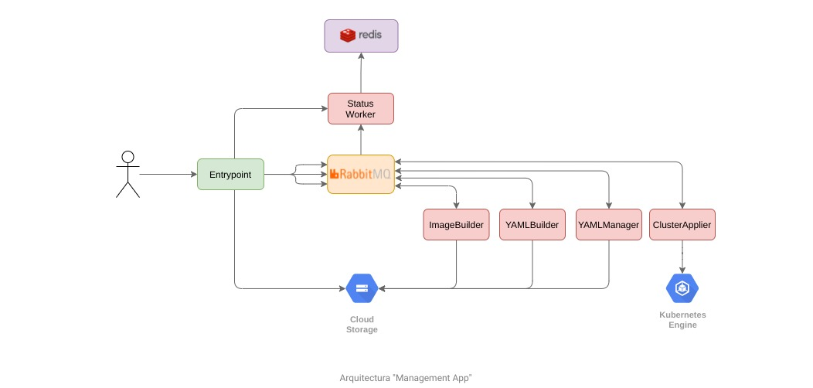

<h1 align="center">Trabajo Práctico Integrador </h1>
<h2 align="center">Sistemas Distribuidos y Programación Paralela</h2>

## Introducción

En el contexto de la asignatura Sistemas Distribuidos y Programación Paralela de la Universidad Nacional de Luján, se propone y documenta la creación de una herramienta de cómputo intensivo basado en un modelo SWJ (Splitter-Worker-Joiner) para la resolución de tareas genéricas, apoyado en la plataforma de gestión de contenedores Kubernetes y tecnologías de Cloud Computing. Todos los componentes utilizados (propios y de terceros) presentan características de alta disponibilidad y tolerancia a fallos. 

La herramienta está orientada, por el momento, al uso exclusivo de los autores del trabajo. Sin embargo, se toman algunas consideraciones para soportar aspectos tales como cargas de tráfico mayores resultantes de publicar la aplicación. En la sección de Alcance se presentan los límites del mismo.

La motivación principal del trabajo es la necesidad ocasional de ejecutar tareas que se verían beneficiadas de una gran capacidad de cómputo para la obtención de resultados. Dado que el costo de contar con una infraestructura disponible 24/7 que permita satisfacer los requerimientos eventuales implicaría un costo excesivo y un gran desperdicio la mayor parte del tiempo, la propuesta considera desde la creación hasta la destrucción de los recursos necesarios de manera automatizada, tan solo configurando unas pocas variables dependientes. 

### Alcance

Concretamente, el presente trabajo aporta:
- Los scripts necesarios para la creación de la infraestructura en Google Cloud Platform mediante Terraform. 
- La documentación de los pasos previos requeridos para poder crearla.
- La configuración y puesta en funcionamiento de un pipeline de CI/CD para la herramienta en sí misma y los recursos auxiliares.
- Los manifiestos de Kubernetes que serán desplegados por el componente de CD (Continuous Delivery) y las imágenes de Docker para cada uno de los componentes de la herramienta, independientes de la tecnología subyacente. 
- Una herramienta de gestión denominada Management App, que permite ejecutar tareas genéricas con alta capacida de cómputo de forma transparente al usuario.
- La configuración necesaria para lograr el auto-escalado de los componentes de apoyo e involucrados en la tarea del usuario, como así también la replicación de los mismos - cuando se requiera - para lograr tolerancia a fallos. 
- La documentación de cada uno de los recursos utilizados y su función en el proyecto, así como ventajas y desventajas identificadas por su uso. 
- La implementación de la herramienta Prometheus para el monitoreo de los servicios, y Fluentd para la recolección de logs, junto al stack ELK para identificar errores y fallas en la aplicación y sus dependencias, utilizando tableros de visualización y alertas. 

### Out-of-scope

Algunas cuestiones no consideradas por el trabajo hasta el momento, que presentan oportunidades de extensión a futuro, son:
- La publicación de la herramienta para uso de terceros, y como consecuencia:
    - La prevención de que individuos maliciosos la utilicen para ejecutar ataques.
    - Un esquema de medición y costo frente al uso de la herramienta.
    - Implementación de mecanismos de seguridad para evitar ataques a la propia infraestructura. 
- La posibilidad de entregar imágenes Dockerizadas o incluso, código fuente, en lugar de manifiestos de Kubernetes. 

## Paso a paso - Eliminamos esta sección? <--------------------------------- 

En esta sección se linkea a los readme del propio repo. 

1. Terraform/README.md
2. ArgoCD/README.md
3. Docker/README.md 

- La documentación para el que quiere implementarlo + explicación de cómo funciona 
    - Levantar local (sin ci/cd)
    - Hacer los pasos idénticos a como lo usamos nosotros

- La documentación para el usuario final: esta sería cómo usar el FW

## Pipeline CICD

La Management App cuenta con un pipeline de CI (Continuous Integration o Integración Continua) que se activa al modificar el código fuente del proyecto o algún Dockerfile dentro del directorio `Docker/`. Esta funcionalidad está implementada a través de Github Actions, reaccionando ante commits del usuario a los paths correspondientes del repositorio.

A su vez, frente a la modificación en los manifiestos de las carpetas `Kubernetes/Management` y `Kubernetes/Resources` - sea manual (por el usuario) o automática (llevada a cabo por Github Actions en el pipeline de CI) - se desencadena el circuito de CD (Continuous Deployment o Entrega continua) implementado a través de ArgoCD, quien se encargará de determinar las diferencias en los manifiestos del clúster correspondiente, aplicando estos cambios y reflejando el estado correcto. 

En el gráfico a continuación, se detallan los pasos y la relación entre CI/CD para la Management app.

### Etapas del pipeline

A continuación, una breve explicación de cada uno de los pasos involucrados en el pipeline de la *Management app*. Dado que la aplicación está compuesta de varios microservicios, debemos considerar que el flujo será idéntico para cada uno de ellos, a excepción de las rutas de los directorios involucrados.

1. **Preparación - Setup Job**: En este caso, Github corre un ubuntu-latest en el cual realizará los pasos declarados en cada uno de los *workflows* de la carpeta `github/workflows/`.
2. **Checkout código**: Clona el repositorio completo, para poder armar la imagen Docker con los últimos cambios.
3. **Setup Java JDK**: Instala y disponibiliza Java JDK para poder compilar el código Java de cada una de los componentes.
4. **Build con Maven**: Empaqueta el código en un archivo .jar, y lo guarda en el directorio del componente, bajo la ruta `/target`.
5. **Mover el jar al contexto del Dockerfile**: Mueve el archivo .jar creado en el paso anterior al directorio `Docker/` del proyecto, en una subcarpeta correspondiente al componente afectado.
6. **Loguearse a DockerHub**: Se autentica con DockerHub utilizando un nombre de usuario y un token, para permitir subir la imagen luego de armarla.
7. **Crear archivo de credentiales**: Arma un archivo de credenciales cuyo contenido es un *secret* del repostorio, requerido por el código para autenticarse en el clúster de Deployments y acceder al *Storage* compartido.
8. **Build y Push de imagen docker**: Se construye la imagen de Docker utilizando el Dockerfile del componente bajo el subdirectorio correspondiente en la carpeta `Docker/`. Luego, se realiza un push de la imagen a dockerHub.
9. **Setup Kustomize**: Instala y disponibiliza Kustomize, que permitirá modificar la imagen de un manifiesto de Kubernetes de forma sencilla.
10. **Actualizar recursos de Kubernetes**: Actualiza el tag de la imagen docker creada en el paso 8, en un archivo de variables de Kustomize.
11. **Kustomize Build**: Aplica el archivo de variables de Kustomize sobre un template, generando el archivo .yaml de salida para el componente afectado, que será colocado en el directorio `Kubernetes/` bajo el subdirectorio correspondiente. Cabe destacar que este archivo contendrá el tag de la imagen actualizado.
12. **Agregar cambios, realizar commit y push**: Se ejecutan los comandos de *git* necesarios para publicar los cambios en el repositorio, lo que provoca que ArgoCD detecte una modificación de los archivos .yaml de Kubernetes y los aplique en el clúster, completando así el pipeline CICD.

**Importante**: En el caso de los componentes del clúster de *Resources* representados por los manifiestos de la carpeta `Kubernetes/Resources`, el circuito de CI no es necesario dado que no se trabaja con el código fuente. Sin embargo, se aprovechan las bondades de ArgoCD para su despliegue en el clúster.

## Management App

Es una aplicación orientada a microservicios encargada de procesar las tareas que el usuario final desea ejecutar en la plataforma HPC. Está diseñada con el propósito de escalar cuando se requiera, por lo que los componentes son independientes entre sí, comunicados a través de colas de mensajería, compartiendo un *storage* en común y utilizando una caché para el almacenamiento de estado de las tareas. 

### Entrypoint 

Es un servicio desarrollado en Java que expone endpoints HTTP desde los cuales recibirá las solicitudes de procesamiento de los usuarios. Cada endpoint espera recibir contenido distinto dependiendo del formato que utilice el usuario para informar la tarea a ejecutar. En el caso de solicitar la ejecución de la tarea mediante manifiestos de Kubernetes, se deberá enviar un `POST /yaml` entregando como cuerpo de la solicitud un conjunto de archivos en formato YAML a aplicar en el clúster. 

Una vez recibida la tarea, el componente genera un identificador que vincule los archivos subidos y los deposita en un almacenamiento compartido con el resto de los microservicios. A su vez, emite un mensaje a un *exchange* de RabbitMQ para notificar a los componentes interesados que existe una tarea en formato YAML pendiente de validación.

### YAML Manager

Frente a la notificación emitida por el Entrypoint, el YAML Manager accederá al almacenamiento compartido para descargar los archivos bajo el identificador recibido y llevará a cabo un circuito de validación. Dependiendo del estado de los manifiestos, procederá a depositarlos nuevamente en el mismo *storage* con las modificaciones pertinentes sobre los archivos originales. A su vez, generará una notificación que será enviada a RabbitMQ para avisar al resto de los componentes sobre el estado de la validación. 

### Cluster Applier

Una vez validados los YAML del usuario, la Management App se encuentra en condiciones de aplicar los manifiestos sobre el clúster de *Deployment*. Esta es la tarea del Cluster Applier, que al recibir la notificación del YAML Manager indicando la validación exitosa, accederá al *storage* compartido para descargar los archivos y aplicarlos. 

Para poder interactuar con el clúster, el Cluster Applier utiliza la herramienta de linea de comandos de Kubernetes: `kubectl`. Para ello, necesita tenerla instalada en el entorno de ejecución; por eso, en `Docker/Cluster-Applier/Dockerfile` podemos observar el uso de una imagen base de OpenJDK propia y modificada, cuyo contenido puede verse reflejado en `Docker/Openjdk/Dockerfile`.

### Status Worker

Se trata de un componente auxiliar que da seguimiento al estado del job del usuario. A partir del evento de "tarea pendiente" publicado por el Entrypoint, el Status Worker almacena en Redis el identificador de la tarea junto con un estado PENDING. Una vez validados los YAMLs del usuario y publicado el evento por el YAML Manager, se procede a la actualización del estado a APPLYING_IN_CLUSTER. Cuando el Cluster Applier finaliza la aplicación de los manifiestos y emite el evento correspondiente, este componente actualiza el estado a DONE. Eventualmente, el usuario solicitará la eliminación de la tarea, por lo que se realizará una vuelta atrás de los recursos en el clúster. Esto dispara la notificación correspondiente, resultando en una actualización del estado a ROLLED_BACK.

Gracias a la arquitectura desacoplada de la solución, este componente se suscribe a los mismos *exchanges* utilizados por el resto de los microservicios, sin necesidad de hacer explícito el envío de los mensajes.

El servicio expone un endpoint HTTP desde el cual puede consultarse el estado de la tarea a través del identificador generado para la misma. 

## Infraestructura

Tanto la Management App como los recursos auxiliares y - principalmente - las tareas del usuario, son gestionados mediante la plataforma de contenedores Kubernetes. A continuación, se brinda mayor detalle con respecto a la distribución de los recursos, proveedor de cómputo en la nube utilizado, interrelación entre los servicios necesarios, entre otros.

La arquitectura de la aplicación consta de 3 clústers: *deployments*, *resources* y *management*. Todos ellos poseen *nodos privados*, es decir, que no tienen direcciones IP públicas. Esta decisión se ve justificada por el costo y porque en el presente resultan dispensables.

Cada clúster tiene configurada una *VPC* o *Virtual Private Cloud*, donde se alojan los *nodos*, *pods* y *servicios* de cada uno.

Para lograr que los nodos tengan acceso a Internet, fue necesario configurar un *Cloud Router* en cada una de las *VPCs* de los clústers, que realice un enmascaramiento de la dirección IP privada por una pública. Esto se logró utilizando *Cloud NAT*.

Las instancias utilizadas son de tipo *preemptible*, equivalentes a las conocidas como *instancias spot* en AWS, ya que tienen un costo reducido. Como contrapartida, solo duran 24 horas como máximo lo cual puede resultar inconveniente para ciertos casos de uso.

Los clústers de *deployments* y *resources* deben poder comunicarse entre sí, ya que las aplicaciones que se encuentren en el primero necesitan consumir los servicios que proveen los recursos alojados en el segundo. Para esto fue necesario configurar *VPC Peering*, habilitando el routeo entre las *VPCs* del clúster de *deployments* y el de *resources*.

A su vez, fue necesario agregar las respectivas reglas de *firewall* para permitir el tráfico entre las *VPCs* mencionadas anteriormente.

Todos los clústers se encuentran configurados con *cluster auto scaler* y *horizontal pod autoscaler*.

Para lograr comunicar a las aplicaciones del clúster de *deployments* con los recursos alojados en el clúster de *resources* fue necesario levantar servicios de tipo "internal", ya que - de lo contrario - los pods de las aplicaciones no podían acceder a los servicios, por más que se encuentren en *VPCs* emparejadas, con el tráfico permitido a través del firewall.

### Scripts

Dado que el proyecto fue construido con el propósito de ser utilizado desde cero sin necesidad de conocer en detalle su funcionamiento, se construyeron los scripts necesarios para crear y descartar todos los elementos involucrados, facilitando la tarea al usuario. 

#### Despliegue

Este puede encontrarse en `/Terraform/deploy.sh`. 

#### Destrucción

Este puede encontrarse en `/Terraform/destroy.sh`. 

Terraform
GKE
Cloud DNS
Cloud Routers
Cloud NAT
Bucket
Firewall Roules
VPC Peering
ExternalDNS
Preemtible
3 Clusters

## Kubernetes

ArgoCD Apps
Helm Subcharts
.yamls

TRANSPARENTE A GOOGLE

## Autoscaling

Cluster Autoscaler
HPA
Prometheus
Prometheus Adapter
Recording Rules
Custom API
Ingress
Ingres Controller NGINX

## Replication

Redis Cluster Mode
Redirect, Lettuce

RabbitMQ clúster Mode
Quorum queues

## Logging/Monitoring

Fluent-bit
Logstash
Elasticsearch Cluster Mode
Kibana
Grafana
Prometheus ?
